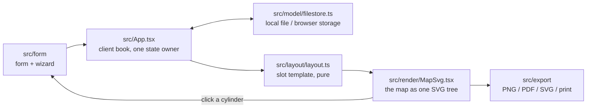

# Money Map Generator

[](https://cmathew654-dot.github.io/money-map-generator/)
[](https://react.dev/)
[](https://vite.dev/)
[](LICENSE)


I built this browser-local editor to replace the PowerPoint diagrams I used for client meetings. I prepare each map in 15–30 minutes instead of 2–3 hours, then export it as an image or PDF.

The demo uses fictional data. Imported books stay in the browser.

**[Open the live demo](https://cmathew654-dot.github.io/money-map-generator/)**


## What it does

| Area | Behavior |
| --- | --- |
| Client book | One local book holds the client maps and saves changes in the browser. Users can connect it to a file on disk or OneDrive. |
| Live editing | The form updates the map after each keystroke. |
| Advisor conventions | The map uses familiar tax-bucket colors and refill arrows. It also supports RMD notes and account detail. |
| Blank values | An empty dollar value appears as `~$ ______` for use during a meeting. |
| Exports | Advisors can save an image or PDF, or print a landscape page. |
| Local processing | The browser parses imported books. Users should load only data they have authority to handle. |

## Architecture

React and React DOM are the only runtime dependencies. `App.tsx` owns state, while pure functions handle layout and file operations.



| File | Responsibility |
|---|---|
| `src/App.tsx` | The one state owner: client book + active client; header; two panes |
| `src/model/types.ts` | Domain model (`MoneyMapFile` → `MoneyMapData` → accounts, positions, sub-accounts) |
| `src/model/book.ts` | Pure book operations (add / duplicate / delete / update / parse) |
| `src/model/format.ts` | Currency + blank formatting, text wrapping (pure) |
| `src/model/samples.ts` | Fictional sample clients + blank template |
| `src/layout/layout.ts` | Deterministic slot-template layout: data in → positioned boxes and SVG paths out (pure, no React) |
| `src/render/MapSvg.tsx` | The map as one SVG component tree |
| `src/render/tokens.ts` | Design tokens; edit this file to change the visual system |
| `src/form/Form.tsx` | The form |
| `src/export/export.ts` | PNG / PDF / SVG export (fonts embedded), JSON save/load |
| `src/styles/` | App shell + print stylesheet |
| `tests/` | Vitest: formatting, layout geometry (overlap, waterfall order, clearance), book ops, filenames |

A slot template handles layout because a money map has a fixed reading order. Content-aware sizing keeps labels and account contents inside their assigned areas.

## Build history

The tool grew through a series of small passes: the form first, then layout,
editing, local file handling, and export.

## Run it

```
npm ci
npm run dev      # local dev server
npm test         # vitest
npm run build    # production build to dist/
```

Typefaces: [Literata](https://github.com/googlefonts/literata) and
[Public Sans](https://public-sans.digital.gov/) (both SIL OFL), self-hosted.

## License

[MIT](LICENSE) © 2026 Cyril Mathew.
