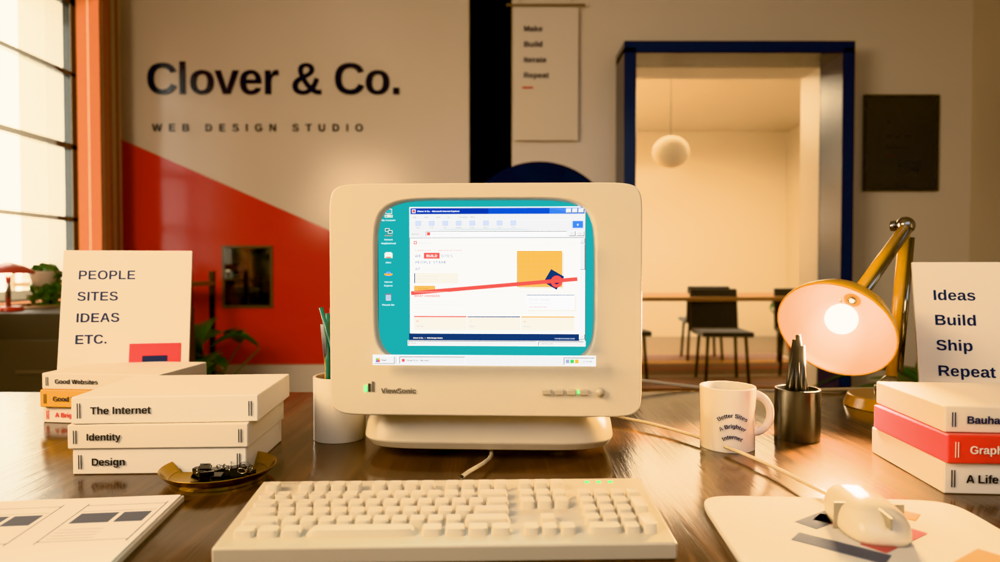

# Clover & Co. — studio scene

A photographic reference of a 1990s design studio, rebuilt in Blender as a
fully procedural scene. Nothing here is a downloaded asset or an external
texture: every mesh is generated from code and every material is a shader
network, so the whole image is reproducible from this directory alone.



Live walkthrough: https://claude.ai/code/artifact/d5244569-42da-450b-9509-a368ea5a6457
Handoff: https://claude.ai/code/artifact/3b3e68ab-722e-4747-8d52-a5ce471a6fe1 (`docs/HANDOFF.html`)
Roadmap: https://claude.ai/code/artifact/dc358818-dc5c-42ec-bbf9-e089986660ab (`docs/ROADMAP.html`)

## Running it

The scene is written against the `bpy` API and was built with Blender 5.2 via
the pip module — no Blender install required. `renders/clover-studio.blend`
is a 5.2 file and will not open in 4.x.

```bash
# headless via pip (Python 3.13 -- bpy 5.x wheels are cp313 only)
python3.13 -m venv .venv && .venv/bin/pip install -r requirements.txt

# the committed still: 1600x900, 96 samples, ~9 min on 4 CPU cores
.venv/bin/python -m scene.build --samples 96 --width 1600 --height 900

# or from a Blender 5.x binary
blender -b -P run.py -- --samples 96 --width 1600 --height 900
```

Text objects use Liberation Sans (Linux) or Arial (Windows/mac); the two are
metric-compatible. Set `CLOVER_FONT_DIR` to a folder of Liberation TTFs to pin
the exact faces on any platform.

### The browser walkthrough

```bash
cd web && npm install && python ../.venv/bin/python build.py
# -> web/dist/clover-studio.html, one self-contained page
python3 -m http.server 8777 --directory dist
```

`build.py` runs export → gltfpack → esbuild → assemble, skipping stages whose
output exists. Pass `--fragment` to produce the headless form the Claude
artifact wrapper expects. See `docs/REVIEW-2026-09-06.md` for what a second
model found when it tried to rebuild this from a clone, and what was fixed.

Useful flags:

| Flag | Default | Notes |
| --- | --- | --- |
| `--samples` | `192` | Cycles samples. 32 is enough to judge composition. |
| `--width` / `--height` | `1920` / `1080` | |
| `--glow` | `1.95` | Emission multiplier for the CRT interface. |
| `--exposure` | `0.18` | Stops, applied in colour management. |
| `--glare` / `--vignette` | `0.07` / `0.26` | Post-pass strength; `0` disables. |
| `--view` | `Khronos PBR Neutral` | View transform. `AgX` for a flatter grade. |
| `--save-blend` | — | Write a `.blend` you can open and fly through. |
| `--gltf` | — | Write a `.glb` for viewing outside Blender. |
| `--no-render` `--stats` | — | Build only, and print object/triangle counts. |

## How it is put together

```
scene/
  util.py          mesh primitives: lofts, superellipses, struts, text
  palette.py       every colour in the film, as hex + linearisation helpers
  materials.py     procedural shaders -- wood, plastic, cloth, ceramic, leaf
  screen.py        the Windows 95 desktop and the Clover & Co. homepage
  crt.py           the monitor
  peripherals.py   keyboard, mouse, mousepad, cables
  props.py         books, mug, pens, brass tray, sketchbook, ruler
  furnishings.py   wall art, lamps, shelving, meeting-room furniture
  plants.py        procedural monstera, pothos and shelf greenery
  room.py          floor, walls, window, doorway, painted branding
  lighting.py      sun, window, practicals, world
  camera.py        the matched camera
  post.py          linear-space bloom and vignette
  build.py         assembly, render settings, CLI
```

A few things worth calling out:

**The monitor** is lofted from superellipse cross-sections rather than
modelled as a rounded box. That is what gives a CRT its particular
silhouette — a boxy bezel that crowns slightly, sides that run straight for
most of the depth, then a hard taper back to the neck. The tube face is a
bulged squircle sitting behind a transmissive glass shell, so the picture is
genuinely seen *through* glass and picks up room reflections.

**The screen** is not a texture. The Win95 chrome, the browser and the web
page are ~400 emissive plates and text objects laid out on a virtual 640×480
raster (`screen.Raster` maps pixel coordinates to the monitor's local
metres). That means the interface actually lights the keyboard and desk in
front of it, and the bevelled Win95 controls cast their own microscopic
shadows. Emission colours are linearised first — a navy pixel really does
emit a fraction of what a white one does, and skipping that step washes the
whole picture out.

**The lens finish** happens in `post.py` rather than Blender's compositor,
which needs a GPU context that headless machines often lack. The render goes
to a linear EXR, numpy applies multi-scale bloom and a vignette to real
radiometric values, and Blender's colour management writes the final PNG.

## Exploring the scene

`--save-blend` writes a `.blend` with the full procedural setup intact —
open it and fly the viewport freely.

`--gltf` writes a `.glb` for web viewers and other DCC tools. Note the
tradeoff: glTF has no way to carry a procedural shader network, so surfaces
arrive as their flat Principled values. Geometry, layout and colour survive;
wood grain, fabric weave and brick do not. Baking those to image textures
first would fix it, at the cost of a long bake.

## Deliberate departures from the reference

- The window sits in the back-left corner rather than mid-wall, so it reads
  in frame at this focal length while still raking light across the desk the
  way the reference does.
- The monitor is a little wider than a period-correct 17" tube, matching the
  proportions in the photograph rather than a real ViewSonic.
- Book and poster copy is set in Liberation Sans, the closest metric match
  available without shipping font files.
