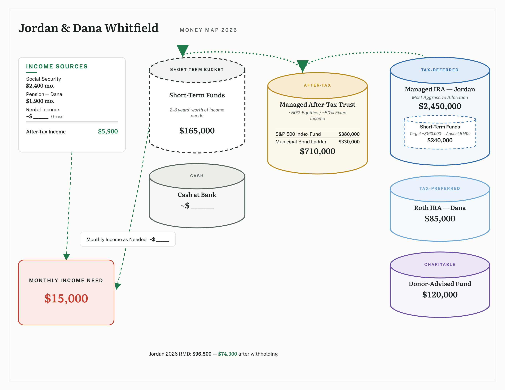

# Money Map Generator

Financial advisors walk clients through a one-page "money map": income
sources on the left, accounts drawn as cylinders color-coded by tax bucket,
a monthly income need, and dotted arrows showing how the buckets refill.
In most practices that page is hand-built in PowerPoint — nudged shapes,
retyped numbers, copy-paste drift across every client and every review
season.

This tool generates it. Fill in a form; the map draws itself.

**Live demo:** https://cmathew654-dot.github.io/money-map-generator/ — all
sample data is fictional. Click any cylinder on the map to jump to its form
card.



*All sample data is fictional.*

## What it does

- **The whole practice in one book** — instead of maps buried in client files
  inside folders inside folders, one book holds every client's map and
  auto-saves locally. Connect it to a real file and it saves to your own disk
  or OneDrive.
- **Live generation** — a plain form on the left, the finished map on the
  right, updated on every keystroke. No canvas, no dragging, no design work.
- **The grammar advisors already use** — tax-bucket color coding
  (short-term, after-tax, tax-deferred, tax-preferred, charitable, cash),
  refill-waterfall arrows, RMD footnotes, positions inside an account, and
  nested sub-accounts (e.g. short-term funds earmarked inside an IRA).
- **Blanks are a feature** — any empty dollar value renders as `~$ ______`,
  the fill-in-live-in-the-meeting convention from real practice.
- **Meeting-grade output** — save a high-resolution PNG, PDF, or SVG with
  the typefaces embedded, or print to a single landscape letter page.
- **Private by construction** — fully client-side. No server, no network
  calls, nothing ever leaves the machine. Safe for real client data.

## Architecture

Small on purpose: two runtime dependencies (`react`, `react-dom`),
~15 source files, one state owner, and pure functions for everything that
can be pure.

| File | Responsibility |
|---|---|
| `src/App.tsx` | The one state owner: client book + active client; header; two panes |
| `src/model/types.ts` | Domain model (`MoneyMapFile` → `MoneyMapData` → accounts, positions, sub-accounts) |
| `src/model/book.ts` | Pure book operations (add / duplicate / delete / update / parse) |
| `src/model/format.ts` | Currency + blank formatting, text wrapping (pure) |
| `src/model/samples.ts` | Fictional sample clients + blank template |
| `src/layout/layout.ts` | Deterministic slot-template layout: data in → positioned boxes and SVG paths out (pure, no React) |
| `src/render/MapSvg.tsx` | The map as one SVG component tree |
| `src/render/tokens.ts` | Every color, size, and type decision — the design swap point |
| `src/form/Form.tsx` | The form |
| `src/export/export.ts` | PNG / PDF / SVG export (fonts embedded), JSON save/load |
| `src/styles/` | App shell + print stylesheet |
| `tests/` | Vitest: formatting, layout geometry (overlap, waterfall order, clearance), book ops, filenames |

There is deliberately no graph-layout engine: the money-map genre has a
canonical page layout, so placement is a fixed slot template with
content-aware sizing — which is what makes generation reliable enough to
hand a meeting-grade page to an advisor every time.

## How it was built

Spec-driven delegation: each implementation session was written as a
zero-context specification (`docs/codex/SESSION-*.md`), executed headlessly
by a coding agent, and independently reviewed — gates re-run, diffs read,
and every visual change screenshot-audited before acceptance. The session
specs, reports, and punch lists in `docs/codex/` are the full, honest
history of the build, including the defects the review caught.

## Run it

```
npm install
npm run dev      # local dev server
npm test         # vitest
npm run build    # production build to dist/
```

Typefaces: [Literata](https://github.com/googlefonts/literata) and
[Public Sans](https://public-sans.digital.gov/) (both SIL OFL), self-hosted.

## License

[MIT](LICENSE) © 2026 Cyril Mathew.
