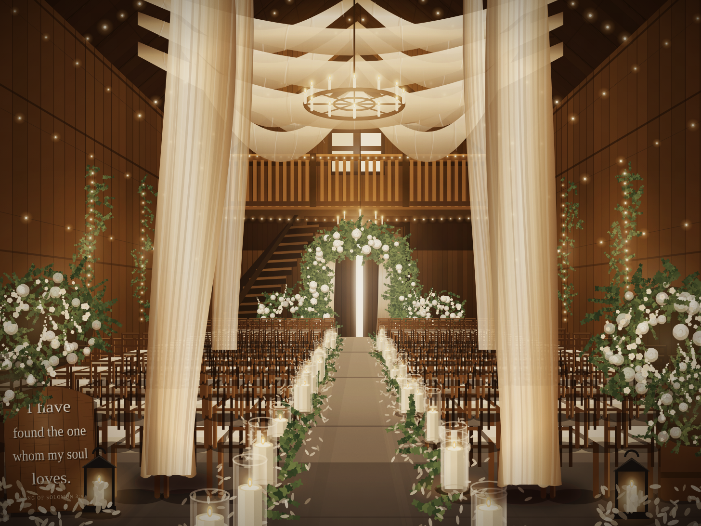

# Candlelit Barn Ceremony

A procedural recreation of a rustic barn wedding ceremony, drawn entirely in
code and output as one self-contained SVG scene — no bitmaps, no external
assets, no tracing.



## How it's built

`generate.py` emits `scene.svg` (and `index.html`, which wraps it). Everything
in the room is placed on a single one-point-perspective solve, so the plank
walls, roof rafters, chair rows, aisle candles and floor joints all converge on
one vanishing point sitting in the open barn doorway:

```
screen_x = VPX + (xf - VPX) * k
screen_y = VPY + (FLOOR - VPY - hf) * k        k = D0 / depth
```

`xf` and `hf` are lateral position and height above the floor in front-plane
units; `k` is the perspective scale at a given depth. Boards, rafters and chair
rows are generated by marching depth forward in even world-space steps
(`depth_series`), which produces correct foreshortening for free.

Built on that grid:

- **Shell** — vertical plank siding on both walls and the gable end, radiating
  roof rafters, collar ties, loft deck with turned balusters, staircase, and
  sliding barn doors with a blade of daylight in the gap.
- **Seating** — ~200 chiavari chairs. Each is drawn with its seat pad receding
  away from the camera, so chairs left of centre show their right side and vice
  versa, exactly as the real geometry demands.
- **Botanicals** — roses are built from guard petals, an inner whorl and a
  spiral centre rather than drawn as discs; greenery is stems of paired leaves.
  The arch, urns, wall garlands and corner arrangements all reuse them.
- **Textiles** — swags are catenaries given width and shaded across the fold;
  the hero pillars are cubic-curve columns with gathered fabric puddling at the
  slab.
- **Light** — candle flames, fairy lights, the chandelier and the doorway are
  screen-blended radial glows, closed out with a warm grade, vignette and grain.

## Run

```sh
python3 generate.py     # writes scene.svg and index.html
```
